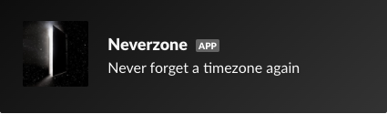
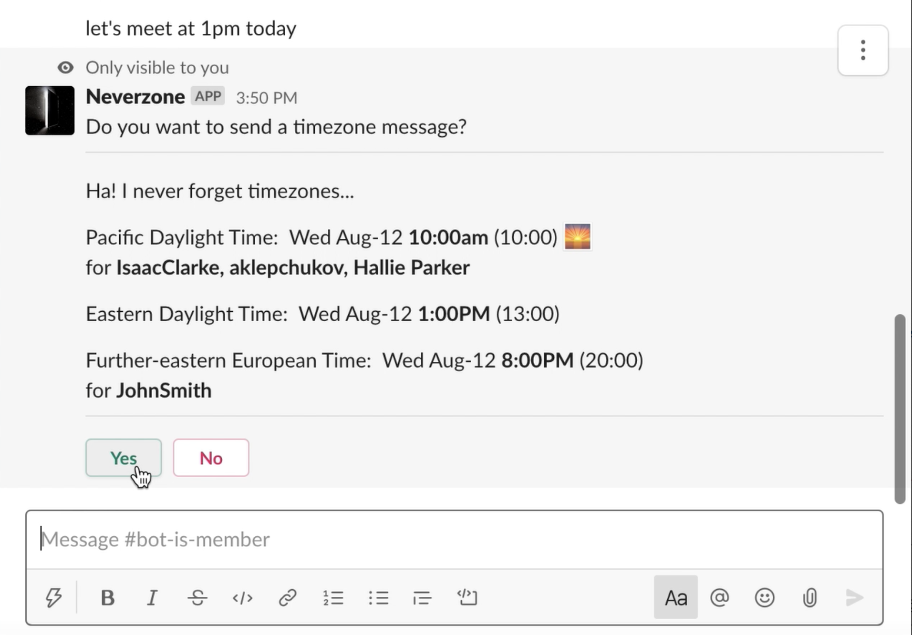
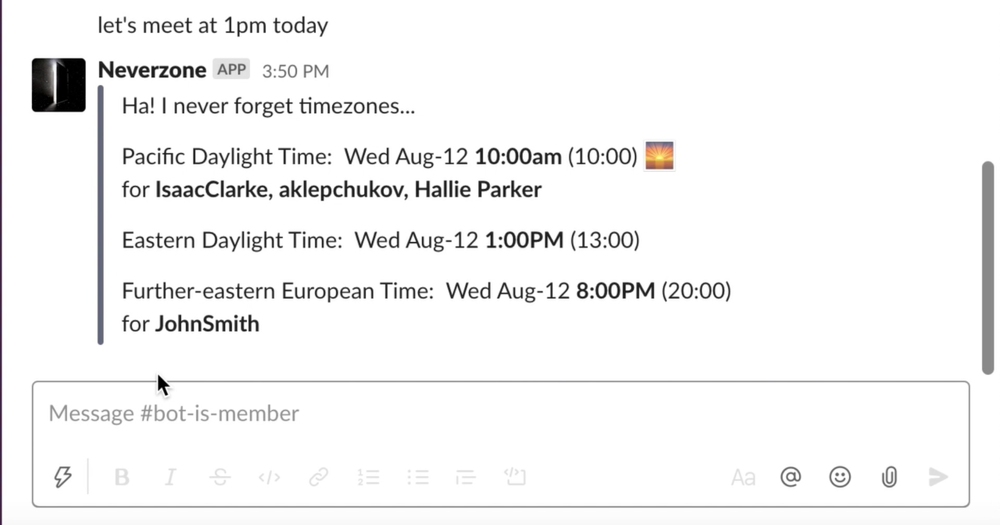

# Neverzone: The Timezone Slackbot
Never forget a timezone again with Neverzone!

## How It Works
Neverzone parses your messages for a time and converts it to the timezones of the other users in the channel/group.

Sending a message with a time will trigger an ephemral message asking you if you want to send a timezone message.

Responding 'Yes' will send a timezone message to the channel/group.

## Creating App on Slack
See [instructions](slackSetup.md) on creating and setting up the slack app.

## Hosting as Lambda
See [instructions](lambdaSetup.md) on hosting as an AWS lambda function