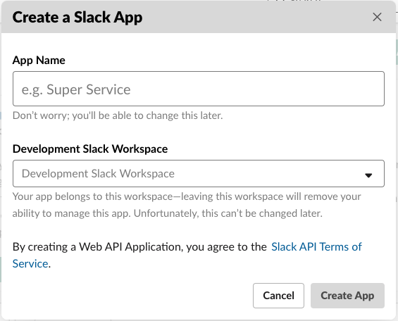
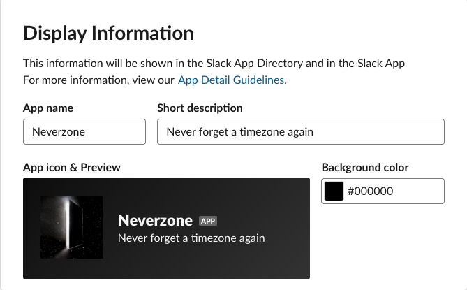
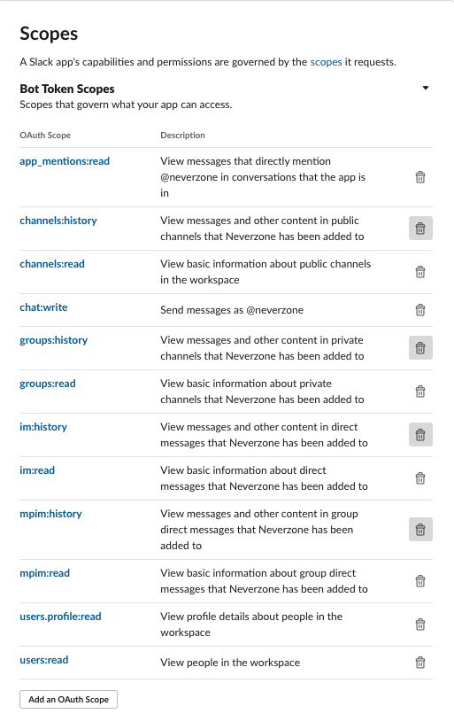
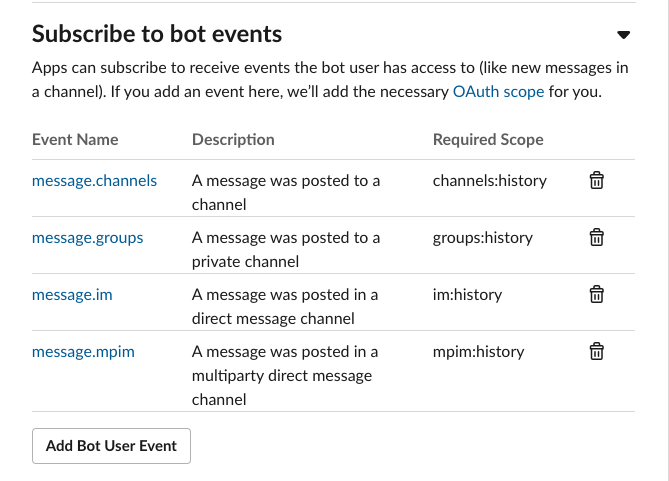
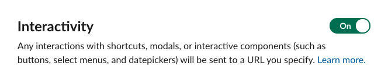

# How to Setup App in Slack

## Creating the app
To get started, create a new Slack App on [api.slack.com](api.slack.com). Click on 'Your Apps' in the top right hand corner, then 'Create New App'. Name the app Neverzone (or whatever you like) and select the workspace in which you would like to create it.

Next, under Settings, go to Basic Information. There, under Display Information, make sure your app has the right name, add a description - for example Neverzone's description is "Never forget a timezone again". Then add the app icon, found [here](images/Neverzone-icon.png), and add a background color - Neverzone uses #000000.

## Permissions
We need to give our bot permission to access certain information. Under OAuth & Permissions, add the following OAuth Bot Token Scopes:

## Event Subscriptions
We want our bot to be aware when messages are sent so we will subscribe to an event.
Under Event Subscriptions, switch the toggle to enable events. The request_url is where the events will be posted - we handle this setup in the [lambda setup instructions](lambdaSetup.md). We want our bot to be aware of all messages sent in channels in which it is a member so we need to subscribe to the following events:

## Interactivity
The ephemral message sent by the bot upon recognition of a time includes button with which a user interacts, thus we need to enable interactivity. Go to Interactivity and Shortcuts and switch the toggle for Interactivity. The request_url is where the interaction will be posted - we handle this setup in the [lambda setup instructions](lambdaSetup.md).

## Installing
Finally, we need to install our app in our workspace. To do this, go to OAuth & Permissions and click "Install in Workspace". You'll also need to hit Allow to give the bot the OAuth permissions we assigned it.
When you make changes to your app on api.slack.com, you will need to reinstall your app to make the changes. To do this go to Install App and click Reinstall App.